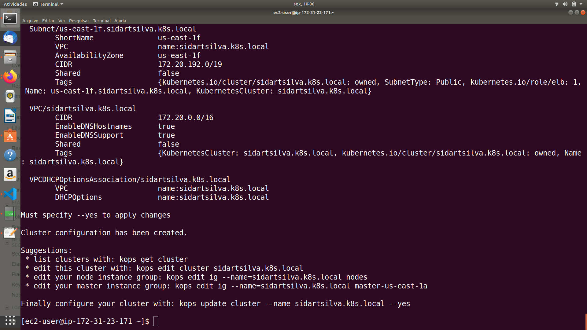
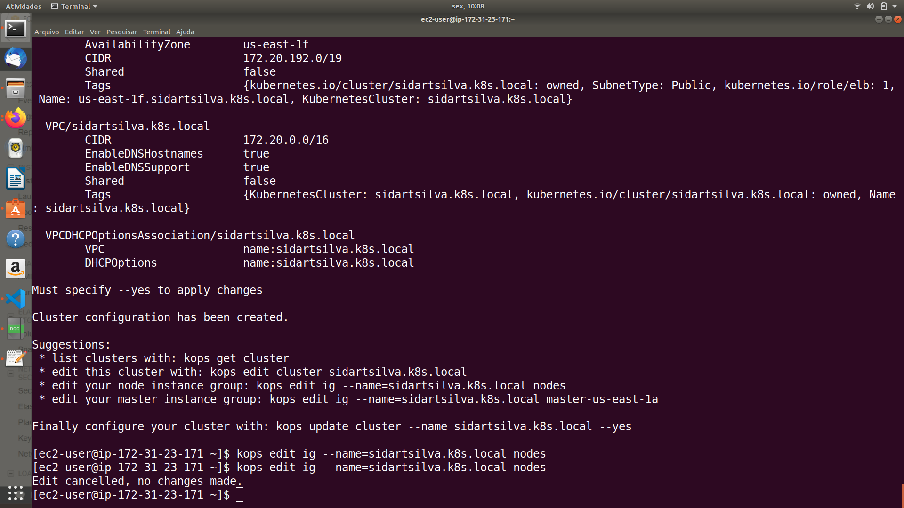

# Project 001 - Vertx HTTP Microservice

A very simple project to learn Vertx for HTTP microservices.

This project is based on the below reference, which can be downloaded at https://developers.redhat.com/promotions/building-reactive-microservices-in-java.

    ESCOFFIER, C. Building Reactive Microservices in Java Asynchronous and Event-Based Application Design. First Edition. California: O’Reilly Media, Inc., 2017.

## Building Reactive Microservices

 

In this chapter, we will build our first microservices with Vert.x. As most microservice systems use HTTP interactions, we are going to start with HTTP microservices. But because systems consist of multiple communicating microservices, we will build another microsevice that consumes the first one.

 

Then, we will demonstrate why such a design does not completely embrace reactive microservices. Finally, we will implement message-based microservices to see how messaging improves the reactiveness.

 

### Implementing HTTP Microservices

Microservices often expose their API via HTTP and are consumed using HTTP requests. Let’s see how these HTTP interactions can be implemented with Vert.x.

### Project Creation

    mkdir project001
    cd project001

    mvn io.fabric8:vertx-maven-plugin:1.0.5:setup \
      -DprojectGroupId=com.sidartasilva.projeto001 \
      -DprojectArtifactId=project001 \
      -Dverticle=com.sidartasilva.projeto001.App
      -Ddependencies=web

### HTTP Microservice Using Routes and Parameters

 

This code creates an HTTP server on port 8080 and registers a requestHandler that is invoked on each incoming HTTP request.

 

Many services are invoked through web URLs, so checking the path is crucial to knowing what the request is asking for. However, doing path checking in the requestHandler to implement different actions can get complicated. Fortunately, Vert.x Web provides a Router on which we can register Routes. Routes are the mechanism by which Vert.x Web checks the path and invokes the associated action.

 

    @Override
    public void start() {
        Router router = Router.router(vertx);
        router.get("/").handler(rc -> rc.response().end("hello"));
        router.get("/:name").handler(rc -> rc.response()
          .end("hello " + rc.pathParam("name")));

          vertx.createHttpServer()
          .requestHandler(router::accept)
          .listen(8080);

    }

 

### Producing JSON

JSON is often used in microservices. Let’s modify the previous class to produce JSON payloads:

 

    @Override
    public void start() {
            Router router = Router.router(vertx);
            router.get("/").handler(this::hello);
            router.get("/:name").handler(this::hello);
            vertx.createHttpServer()
                .requestHandler(router::accept)
                .listen(8080);

    }

    private void hello(RoutingContext rc) {
            String message = "hello";
            if (rc.pathParam("name") != null) {
                message += " " + rc.pathParam("name");
            }
            JsonObject json = new JsonObject().put("message", message);
            rc.response()
                .putHeader(HttpHeaders.CONTENT_TYPE, "application/json")
                .end(json.encode());

    }

 

Vert.x provides a JsonObject class to create and manipulate JSON structures. With this code in place, you should be able to open a browser to:

 

    • http://localhost:8080—You should see {"message": "hello"}
    • http://localhost:8080/vert.x—You should see {"message": "hello vert.x"}

 

 

 
### GitHub

The local project is integrated with GitHub.

 
### GitFlow Workflow

This project is using the GitFlow Workflow as the Version Control strategy.

### Creating a New Feature with GitFlow

    git flow feature start name-of-the-feature

    git status

    git add file1 file2

    git status

    git commit -m "Add message to commit"

    git flow feature publish feature-name

    Got to GitHub. Refresh Project Repository. New Pull Request.

    Choose the feature branch and choose to send to the develop branch.

    Update the Pull Request description section.

    Click on Create Pull Request.

    Execute the Code Review.

    git flow feature finish feature-name

    git push origin develop

### Creating a new Release with GitFlow

    git flow release start 1.0.0

    git flow release finish '1.0.0'

    git checkout master

    git push origin master --tags

    git checkout develop

    git push origin develop

### GitHub versus DockerHub versus CI/CD

GitHub (https://github.com/sidartaoss/projeto-001) is integrating with DockerHub (https://cloud.docker.com/u/sidartasilva/repository/docker/sidartasilva/project001) for CI/CD, i.e., for every new release on GitHub a new build is triggered for creating and exporting a new Docker image to DockerHub.

 
### Dockerfile

    FROM openjdk:8-jre-alpine
    ENV VERTICLE_FILE projeto001-1.0-SNAPSHOT.jar
    ENV VERTICLE_HOME /usr/verticles
    EXPOSE 8090
    COPY $VERTICLE_FILE $VERTICLE_HOME/
    WORKDIR $VERTICLE_HOME
    ENTRYPOINT ["sh", "-c"]
    CMD ["exec java -jar $VERTICLE_FILE"]

 
### Cloud Provider

The chosen Cloud Provider for this project is AWS.

 
### Container-Orchestration System

The chosen Container-Orchestration System for this project is Kubernetes.
 

Kops (Kubernetes Operations) is the tool that is being used to get a production grade Kubernetes cluster.

 
### Cluster

The cluster is named as sidartasilva.k8s.local and is made up of a Master and 3 Worker nodes spread upon 4 Availability Zones: us-east-1a, us-east-1c, us-east-1d, us-east-1f.

### Steps for Recreating the Cluster

The first job to recreate the session after deleting the cluster is to to restart our bootstrap instance.

One thing to check is on our Security Groups for this bootstrap and on the Inbound tab, if we are on the dynamic IP address, we may to do an Edit and set My IP again.

Next we will need to ssh into our instance and our bootstrap instance will have a new Public IP address for this session.

Once connected then we will be able to do a history and then pipe the history into the grep for the phrase export and then we will recall all o the export commands we did in the previous section.

Now the 2 we need are setting the NAME and setting the KOPS_STATE_STORE.

Once we've set those 2 environment variables then we are are rebuilding this kops cluster from scratch so we've got to follow basically all the steps we did previously starting with kops create cluster.

As we have recalled the kops create cluster command with the list of availability zones we just hit return then.

Begin output:

End output:

Now we want the previous situation of having a minimum os 3 nodes so we need to do that with the command kops edit ig --name=sidartasilva.k8s.local nodes to edit the instance group. And we'll change the maxSize to 5 and the minSize to 3.

Once that is done we will then hit the kops update cluster command.

Begin output:

End output:

And then not far to go now let's enter a kops validate cluster command. 

We'll initially get errors. We need to keep repeating this command now for about 5 minutes and so the validation of the cluster succeeds.

And after about 5 minutes a kops validate cluster is now reporting that the cluster is ready.

### Applying the Yaml Files

So all that remains to restore our stack is to take our Yaml files and apply them.

    kubectl apply -f deployment-project001.yaml

    kubectl apply -f service-project001.yaml

## Yaml files

### Deployment Yaml File

This is the Yaml file for the Deployment named as project001. A Deployment triggers creation of a new Pod as well.

 
    apiVersion: apps/v1
    kind: Deployment
    metadata:
      name: project001
    spec:
      selector:
        matchLabels:
          app: project001
      replicas: 1
      template:
        metadata:
          labels:
            app: project001
        spec:
          containers:
          - name: project001
            image: sidartasilva/project001:latest

 
 ### Service Yaml File

This is the YAML file for the Service named as project001. The Service exposes our generated Pod.

    apiVersion: v1
    kind: Service
    metadata:
      name: project001

    spec:
      selector:
        app: project001

      ports:
        - name: http
          port: 8080
      type: LoadBalancer

### Checking Pods and Services

And now let's check the created Pod and Service.

    kubectl get pods

    kubectl get services

We are able to see in EXTERNAL-IP the DNS name of our Load Balancer: a83f66567fce411e9bd7912dd9018b52-56000386.us-east-1.elb.amazonaws.com.

 ### Load Balancer

This is the AWS Load Balancer created into our cluster.

The DNS name of the Load Balancer lets us to finally call our Vertx HTTP Microservice by entering the URL on the browser:

And by hitting /vertx:

